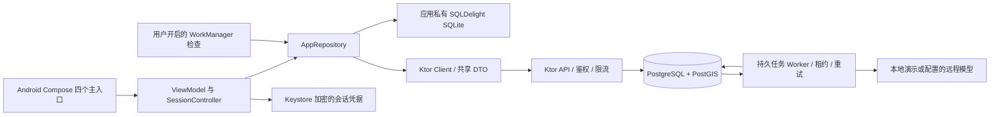

# AncientPoet 0.2.0 架构

当前维护主线为 Android 文字书信、诗词阅读、通信地图和账号管理。本文描述已经接入的运行时；历史社区／媒体类仍在源码中，不代表入口或服务可用。

## 运行关系

SQLite 不额外加密，访问令牌与刷新令牌单独经 Keystore 加密。Redis 和 MinIO 并非文字书信的就绪条件；JPush 保留可选 REST 适配器，Android 0.2.0 使用 WorkManager，不依赖 JPush SDK。

## 模块职责

| 模块 | 职责与界限 |
| --- | --- |
| shared | 可序列化契约、类型化 API 错误、缓存/草稿 schema、地图投影等跨层逻辑；不是完整共享 UI |
| androidApp | Compose 界面、导航与账号生命周期、草稿同步、前台轮询、阅读设置、数据导出和后台提醒 |
| server | JWT 会话、短信、权限、限流、数据库事务、生成/投递/摘要任务和公共内容 API |
| desktopApp | 可编译的占位窗口，尚无完整产品功能 |
| data | 资料源与核心诗词核校清单；运行时使用 Flyway 写入的数据库记录 |

服务端采用 Hikari 连接池、短 JDBC 事务和部分 Exposed 只读查询。网络生成过程在事务外执行，不能长时间占用用户或会话行锁。

## 一封信的生命周期

1. 客户端在本机保存正文与 UUID。用户确认服务端给出的等待时间后，提交正文与 `clientMessageId`。
2. 服务端校验账号、会话、位置、配额和输入；在同一事务内写入已可见的用户信件与生成任务，返回真实消息 ID。重复 UUID + 相同正文返回原收据；同一 UUID 更换正文返回冲突。
3. Worker 用 `FOR UPDATE SKIP LOCKED` 领取持久任务，记录租约和执行标识。生成请求只包含此前已经到达的信件及一次本次输入。
4. 生成成功后原文、待投递时间和翻译任务持久保存。翻译独立重试，失败不阻塞原文到达。
5. 到期后原文转为可读并形成摘要/通知任务；客户端收件箱显示未读与在途数量。未到达接口不返回正文或译文。
6. 过期租约可以被接管。提交结果需匹配有效执行标识，避免过期 Worker 或并发重试重复写入。摘要仅覆盖对应快照，不越过未完成消息。

数据库侧保证信件和任务的幂等落库；进程在远程响应与本地提交之间崩溃时，远程模型请求仍可能重复计费，不宣称第三方调用具备 exactly-once 语义。

最新消息默认取 50 条并按时间正序呈现，`beforeId` / `afterId` 游标用于补页和增量读取；客户端读取旧页时不会被自动滚动强行拉回底部。

## 会话与账号边界

- JWT 明确区分 access / refresh；API 访问不能使用 refresh token。JWT 的 session ID 必须对应数据库中有效会话。
- 刷新令牌只以哈希存储，轮换后重放旧令牌会撤销该会话；退出和删除立即使服务端会话失效。
- Android 的 SessionController 用互斥与身份版本检查阻止迟到刷新覆盖新的登录或退出。
- 私有请求带预期账号 ID，客户端和服务端均检查账号一致性；缓存按 userId 分区，账号变化重置私有导航和 ViewModel。
- 短信挑战、尝试次数、有效期、冷却和 UTC 每日预算保存在 PostgreSQL。生产缺少短信配置返回不可用，不报告发送成功。
- 已验证用户使用用户级限流桶；匿名与短信端点使用 IP 桶。只有配置的实际代理连接才可提供 `X-Real-IP`，不信任任意客户端转发头。
- 对外错误包含类型和请求标识，不暴露 SQL、令牌或内部堆栈。

## Android 状态与界面

AppRepository 统一类型化请求和缓存，资源缓存写入失败不掩盖成功响应；寄信前草稿持久化失败则保留可见错误，避免误报保存成功。旧回执仅清除对应 UUID 的草稿。

首页与会话页面通过前台轮询及变更事件刷新，断网时可先显示已有缓存。后台 WorkManager 仅在用户开启后安排网络任务，按账号记录已通知的最新未读消息 ID；通知仅提示有回信，退出时取消任务和通知。

主导航为“书信／诗人／驿路／我的”。诗词阁从诗人入口进入；游客可阅读公共内容，私有操作引导登录，并保留所选诗人与年代。纸色、墨色、朱色与夜间色板保持同一套层级，避免将历史占位功能放入主流程。

## 数据与迁移

| 版本 | 内容 |
| --- | --- |
| V1–V3 | 原始用户、诗人、通信、城市、诗词与种子资料 |
| V4 | 修复旧信件送达状态和默认年份；幂等、已读、归档、级联删除；持久任务、会话与短信；补齐休眠社区表 |
| V5 | 原文来源字段与 10 篇核心诗词全文、项目导读 |
| V6 | 共享短信每日预算表 |

已验证全新数据库与 V3 数据升级，保留信件与摘要。生产执行迁移前必须备份；迁移后回退应采用经过演练的备份恢复，而非假定旧服务可安全读取新结构。

当前 15 位诗人均可解析，默认通信年落在生卒年内。李白、杜甫、苏轼、李清照、王维各有 2 篇本轮核校的完整原文和来源；其余旧资料继续标记核校状态。城市与路线使用统一投影，但属于示意地图。

## 部署与健康

Ktor 服务运行在宿主机；Compose 提供绑定回环的 PostgreSQL。Nginx 模板负责 HTTPS 反向代理，需配置真实域名、证书与可信代理地址。

- `/api/v1/health/live`：进程存活。
- `/api/v1/health/ready`：必要数据库可用。
- 生产启动禁止本地演示和 HTTP 模型端点，Android Release 禁止未配置或明文 API。
- 关闭时停止并等待 Worker，释放 HTTP 客户端、Koin 与连接池。
- 本地运行脚本复制独立的不可变胖 JAR，避免构建覆盖正在运行的类资源。

还未完成：真实供应商联调、正式签名与分发、生产代理运行验证和备份恢复演练、多实例负载与容量测试、真机后台可靠性、完整桌面/Web 产品。参见 [状态](docs/STATUS.md) 与 [验证](docs/VERIFICATION.md)。
