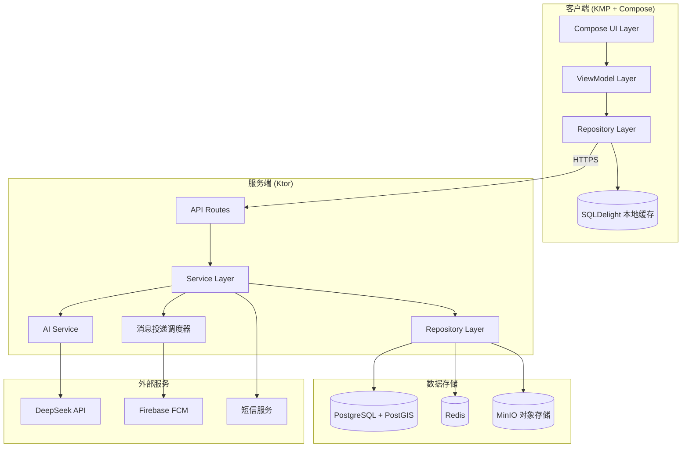
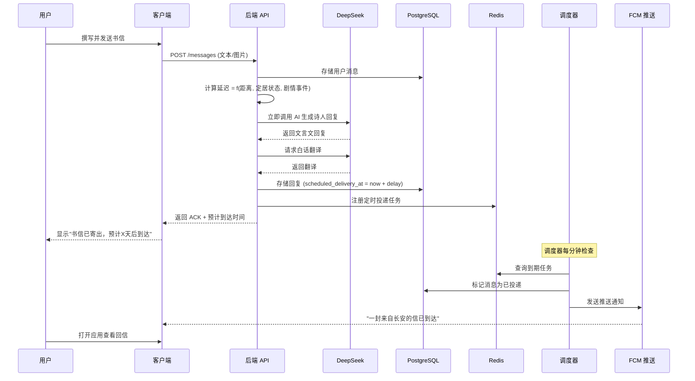
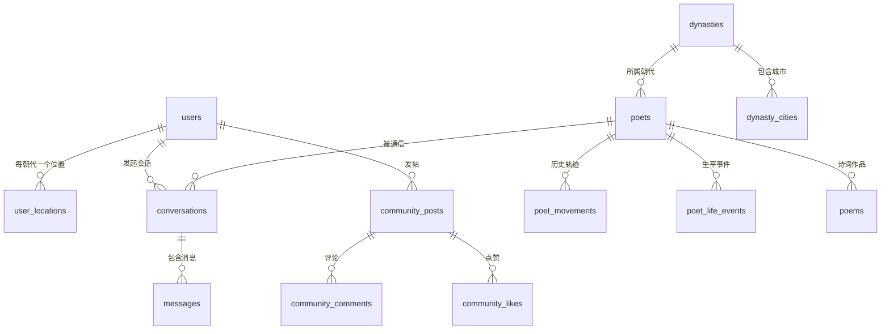

# 🏯 AncientPoet（鸿雁）— 完整技术架构设计文档

> **Tagline**: 在快时代慢下来，像"当时"一样交流  
> **文档版本**: v1.1 | **日期**: 2026-05-13

---

## 1. 项目概览

### 1.1 核心概念

AncientPoet 是一款跨平台慢交流应用。用户与 AI 扮演的古代诗人通过"书信"进行交流，消息根据古代地图上的地理距离产生真实延迟（数小时到数天），引导用户沉下心来写出更长、更有深度的内容。

### 1.2 产品名称建议

| 候选名 | 含义 | 适用场景 |
|--------|------|----------|
| **鸿雁** | 古代书信的代名词（"鸿雁传书"） | 品牌感强，大众认知度高 |
| 尺素 | 古代用于写信的绢帛 | 文雅，适合文艺定位 |
| 驿书 | 驿站传递的书信 | 直观，强调传递过程 |

> 以下文档统一使用 **AncientPoet** 作为项目代号。

### 1.3 目标平台（优先级排序）

1. **Android**（主平台，首发）
2. **Desktop**（Windows，第二阶段）
3. **Web**（第三阶段）

---

## 2. 技术栈选型

### 2.1 总览

```
┌─────────────────────────────────────────────────┐
│                   客户端 (Kotlin)                 │
│  ┌──────────┐  ┌──────────┐  ┌───────────────┐  │
│  │ Android  │  │ Desktop  │  │  Web (Future) │  │
│  │ Compose  │  │ Compose  │  │  Compose WASM │  │
│  └────┬─────┘  └────┬─────┘  └───────┬───────┘  │
│       └──────────────┼───────────────┘           │
│              ┌───────┴───────┐                   │
│              │  KMP Shared   │                   │
│              │  (业务逻辑层)  │                   │
│              └───────────────┘                   │
└──────────────────────┬──────────────────────────┘
                       │ HTTPS / WebSocket
┌──────────────────────┴──────────────────────────┐
│                   服务端 (Kotlin)                 │
│  ┌─────────────────────────────────────────────┐ │
│  │              Ktor Server                    │ │
│  ├──────────┬──────────┬──────────┬────────────┤ │
│  │ Auth     │ Message  │ Map      │ Community  │ │
│  │ Service  │ Service  │ Service  │ Service    │ │
│  └──────────┴──────────┴──────────┴────────────┘ │
│  ┌──────────┬──────────┬──────────┬────────────┐ │
│  │PostgreSQL│  Redis   │  MinIO   │ DeepSeek   │ │
│  │ +PostGIS │ (缓存队列)│(对象存储) │   API      │ │
│  └──────────┴──────────┴──────────┴────────────┘ │
└─────────────────────────────────────────────────┘
```

### 2.2 客户端技术栈

| 层级 | 技术 | 选型理由 |
|------|------|----------|
| **语言** | Kotlin | 全栈统一语言，减少个人开发者上下文切换 |
| **跨平台框架** | Kotlin Multiplatform (KMP) | 共享业务逻辑层，Android/Desktop stable |
| **UI 框架** | Compose Multiplatform | Android/Desktop Stable；Web (WASM) Beta，后续跟进 |
| **架构模式** | Clean Architecture + MVVM | 解耦清晰，便于其他 AI 填充功能 |
| **依赖注入** | Koin 4.x | 轻量、KMP 原生支持 |
| **网络请求** | Ktor Client 3.x | KMP 原生、与后端 Ktor 配套 |
| **本地数据库** | SQLDelight 2.x | KMP 跨平台 SQL，替代 Room |
| **图片加载** | Coil 3.x | KMP 支持、Compose 原生集成 |
| **序列化** | kotlinx.serialization | KMP 标准、与 Ktor 无缝配合 |
| **导航** | Compose Navigation (Multiplatform) | 官方方案，各平台一致 |
| **日期时间** | kotlinx-datetime | KMP 时间处理标准库 |

### 2.3 服务端技术栈

| 层级 | 技术 | 选型理由 |
|------|------|----------|
| **语言** | Kotlin | 与客户端统一 |
| **框架** | Ktor Server 3.x | 轻量协程驱动，适合个人开发者 |
| **数据库** | PostgreSQL 16 + PostGIS | 免费、强大；PostGIS 用于地理距离计算 |
| **ORM** | Exposed 0.57+ | Kotlin 原生 SQL 框架，类型安全 |
| **缓存/队列** | Redis 7.x | 消息投递调度、会话缓存、限流 |
| **对象存储** | MinIO | 自托管 S3 兼容，初期免费，后续可迁移至云 OSS |
| **认证** | JWT (ktor-server-auth-jwt) | 无状态、跨平台友好 |
| **数据库迁移** | Flyway | 自动化 schema 版本管理 |
| **SMS 服务** | 阿里云短信 / 腾讯云短信 | 国内短信验证码发送 |
| **推送** | Firebase Cloud Messaging (FCM) | Android 推送标准方案 |

### 2.4 AI 技术栈

| 组件 | 技术 | 说明 |
|------|------|------|
| **文本对话** | DeepSeek V4-Flash | 角色扮演模式；$0.14/M 输入, $0.28/M 输出，成本极低 |
| **图像理解** | DeepSeek V4 Vision / Janus-Pro | 理解用户绘画内容，诗人以文字回应 |
| **文言翻译** | DeepSeek V4-Flash | 将诗人的文言回复翻译为白话文 |
| **SDK** | OpenAI 兼容 SDK | DeepSeek 使用 OpenAI 兼容 API 格式 |
| **Temperature** | 0.7 | 角色扮演最佳平衡点 |

### 2.5 基础设施

**A. 独立部署方案（适合后期稳定运营）**

| 组件 | 方案 | 成本预估 |
|------|------|----------|
| **服务器** | 单台 VPS 2C4G (阿里云/腾讯云) | ¥50-100/月 |
| **容器化** | Docker + Docker Compose | 免费 |
| **反向代理** | Nginx | 免费 |
| **CI/CD** | GitHub Actions | 免费额度充足 |
| **域名** | .com 域名 | ¥60/年 |
| **SSL** | Let's Encrypt | 免费 |

**B. 0 成本内测方案（适合初期调试与 MVP 验证）**

| 组件 | 方案 | 说明 |
|------|------|------|
| **后端托管** | Railway / Render (Free Tier) | 自动打包运行 Ktor 容器 |
| **数据库** | Supabase (Free Tier) | 免费支持 500MB PostgreSQL，且自带 PostGIS 扩展 |
| **缓存队列** | Upstash Redis (Free Tier) | 无服务器 Redis，每天 10,000 次请求免费 |
| **对象存储** | Cloudflare R2 / Supabase Storage | 支持 S3 API，免费额度充足 |
| **CI/CD** | GitHub Actions | 免费构建并自动推送到托管平台 |

---

## 3. 高层系统架构



### 3.1 核心数据流：发送消息




## 4. 数据库 Schema 设计

### 4.1 ER 关系概览



### 4.2 完整表结构

```sql
-- ========== 基础数据 ==========

-- 朝代表
CREATE TABLE dynasties (
    id          VARCHAR(20) PRIMARY KEY,  -- e.g. 'tang', 'song', 'han'
    name        VARCHAR(50) NOT NULL,     -- e.g. '唐朝'
    start_year  INT NOT NULL,
    end_year    INT NOT NULL,
    map_url     TEXT,                     -- 朝代地图资源 URL
    description TEXT
);

-- 朝代城市坐标（用于地图标注和距离计算）
CREATE TABLE dynasty_cities (
    id           BIGSERIAL PRIMARY KEY,
    dynasty_id   VARCHAR(20) NOT NULL REFERENCES dynasties(id),
    name         VARCHAR(100) NOT NULL,   -- 古代名，e.g. '长安'
    modern_name  VARCHAR(100),            -- 现代名，e.g. '西安'
    province     VARCHAR(100),            -- 古代行政区划
    lat          DOUBLE PRECISION NOT NULL,
    lng          DOUBLE PRECISION NOT NULL,
    is_capital   BOOLEAN DEFAULT false,
    -- PostGIS 地理列，用于高效距离查询
    geom         GEOMETRY(Point, 4326),
    UNIQUE(dynasty_id, name)
);
CREATE INDEX idx_cities_dynasty ON dynasty_cities(dynasty_id);
CREATE INDEX idx_cities_geom ON dynasty_cities USING GIST(geom);

-- ========== 诗人数据 ==========

-- 诗人表
CREATE TABLE poets (
    id                 BIGSERIAL PRIMARY KEY,
    name               VARCHAR(50) NOT NULL,       -- 李白
    courtesy_name      VARCHAR(50),                 -- 字：太白
    art_name           VARCHAR(50),                 -- 号：青莲居士
    dynasty_id         VARCHAR(20) NOT NULL REFERENCES dynasties(id),
    birth_year         INT NOT NULL,
    death_year         INT NOT NULL,
    personality_profile JSONB NOT NULL,             -- 性格特征 JSON
    writing_style      TEXT NOT NULL,               -- 文风描述
    system_prompt      TEXT NOT NULL,               -- DeepSeek 角色扮演 system prompt
    biography_summary  TEXT,                        -- 生平简介
    portrait_url       TEXT,
    is_free            BOOLEAN DEFAULT true,        -- 是否免费角色
    created_at         TIMESTAMPTZ DEFAULT now()
);

-- 诗人历史轨迹（按时间段记录所在地）
CREATE TABLE poet_movements (
    id                BIGSERIAL PRIMARY KEY,
    poet_id           BIGINT NOT NULL REFERENCES poets(id),
    year_start        INT NOT NULL,
    year_end          INT NOT NULL,
    location_name     VARCHAR(100) NOT NULL,        -- 古代地名
    lat               DOUBLE PRECISION NOT NULL,
    lng               DOUBLE PRECISION NOT NULL,
    event_description TEXT,                          -- 这段时期的背景
    event_type        VARCHAR(20) DEFAULT 'normal',  -- normal/exile/war/travel/official
    geom              GEOMETRY(Point, 4326),
    CONSTRAINT chk_years CHECK (year_end >= year_start)
);
CREATE INDEX idx_movements_poet ON poet_movements(poet_id, year_start);

-- 诗人生平事件（故事线模式的剧情节点）
CREATE TABLE poet_life_events (
    id               BIGSERIAL PRIMARY KEY,
    poet_id          BIGINT NOT NULL REFERENCES poets(id),
    year             INT NOT NULL,
    age              INT NOT NULL,
    title            VARCHAR(200) NOT NULL,          -- 事件标题
    description      TEXT NOT NULL,                  -- 事件详细描述
    location_name    VARCHAR(100),
    event_type       VARCHAR(20) DEFAULT 'milestone', -- milestone/hardship/achievement/daily
    delay_multiplier REAL DEFAULT 1.0,               -- 延迟倍率（流放=1.5）
    sort_order       INT DEFAULT 0                   -- 同年事件排序
);
CREATE INDEX idx_life_events_poet ON poet_life_events(poet_id, year);

-- 诗词库
CREATE TABLE poems (
    id            BIGSERIAL PRIMARY KEY,
    poet_id       BIGINT NOT NULL REFERENCES poets(id),
    title         VARCHAR(200) NOT NULL,
    content       TEXT NOT NULL,                     -- 原文
    year_written  INT,                               -- 创作年份（可能不确定）
    context       TEXT,                              -- 创作背景
    translation   TEXT,                              -- 白话文翻译
    appreciation  TEXT,                              -- 赏析
    tags          JSONB DEFAULT '[]'::jsonb,         -- 标签 ["送别","边塞"]
    created_at    TIMESTAMPTZ DEFAULT now()
);
CREATE INDEX idx_poems_poet ON poems(poet_id);

-- ========== 用户数据 ==========

-- 用户表
CREATE TABLE users (
    id          BIGSERIAL PRIMARY KEY,
    phone       VARCHAR(20) UNIQUE NOT NULL,
    nickname    VARCHAR(50),
    avatar_url  TEXT,
    bio         TEXT,                                -- 个人简介
    created_at  TIMESTAMPTZ DEFAULT now(),
    updated_at  TIMESTAMPTZ DEFAULT now()
);

-- 用户位置表（每个朝代下独立位置）
CREATE TABLE user_locations (
    id                  BIGSERIAL PRIMARY KEY,
    user_id             BIGINT NOT NULL REFERENCES users(id),
    dynasty_id          VARCHAR(20) NOT NULL REFERENCES dynasties(id),
    location_name       VARCHAR(100) NOT NULL,
    lat                 DOUBLE PRECISION NOT NULL,
    lng                 DOUBLE PRECISION NOT NULL,
    status              VARCHAR(10) DEFAULT 'settled', -- settled / moving
    moving_to_name      VARCHAR(100),
    moving_to_lat       DOUBLE PRECISION,
    moving_to_lng       DOUBLE PRECISION,
    moving_start_time   TIMESTAMPTZ,
    moving_arrival_time TIMESTAMPTZ,
    geom                GEOMETRY(Point, 4326),
    updated_at          TIMESTAMPTZ DEFAULT now(),
    UNIQUE(user_id, dynasty_id)
);

-- ========== 会话与消息 ==========

-- 会话表
CREATE TABLE conversations (
    id                     BIGSERIAL PRIMARY KEY,
    user_id                BIGINT NOT NULL REFERENCES users(id),
    poet_id                BIGINT NOT NULL REFERENCES poets(id),
    mode                   VARCHAR(10) NOT NULL DEFAULT 'open', -- open / storyline
    dynasty_id             VARCHAR(20) NOT NULL REFERENCES dynasties(id),
    storyline_current_year INT,                       -- 故事线当前年份
    storyline_completed    BOOLEAN DEFAULT false,     -- 是否已完成完整故事线
    background_setting     TEXT,                      -- 开放聊天的背景设定
    created_at             TIMESTAMPTZ DEFAULT now(),
    updated_at             TIMESTAMPTZ DEFAULT now()
);
CREATE INDEX idx_conv_user ON conversations(user_id);

-- 消息表
CREATE TABLE messages (
    id                    BIGSERIAL PRIMARY KEY,
    conversation_id       BIGINT NOT NULL REFERENCES conversations(id),
    sender_type           VARCHAR(5) NOT NULL,        -- user / poet
    content_text          TEXT,
    content_image_url     TEXT,                        -- 用户绘画图片 URL
    translation           TEXT,                        -- 诗人消息的白话翻译
    is_delivered          BOOLEAN DEFAULT false,
    scheduled_delivery_at TIMESTAMPTZ,                 -- 计划投递时间
    delivered_at          TIMESTAMPTZ,
    delay_seconds         INT,                         -- 记录实际延迟秒数
    delay_factors         JSONB,                       -- {"distance_km":350,"settled":true,...}
    created_at            TIMESTAMPTZ DEFAULT now()
);
CREATE INDEX idx_msg_conv ON messages(conversation_id, created_at);
CREATE INDEX idx_msg_delivery ON messages(is_delivered, scheduled_delivery_at)
    WHERE is_delivered = false;

-- 对话上下文摘要（用于管理长对话的 AI 上下文）
CREATE TABLE conversation_summaries (
    id              BIGSERIAL PRIMARY KEY,
    conversation_id BIGINT NOT NULL REFERENCES conversations(id),
    summary_text    TEXT NOT NULL,                    -- AI 生成的对话摘要
    covers_up_to    BIGINT NOT NULL,                  -- 摘要覆盖到的最后一条消息 ID
    created_at      TIMESTAMPTZ DEFAULT now()
);

-- ========== 社区 ==========

CREATE TABLE community_posts (
    id                 BIGSERIAL PRIMARY KEY,
    user_id            BIGINT NOT NULL REFERENCES users(id),
    content_text       TEXT,
    content_image_urls JSONB DEFAULT '[]'::jsonb,
    shared_message_ids JSONB,                         -- 分享的消息 ID 列表
    type               VARCHAR(10) DEFAULT 'original', -- original / repost
    repost_of_id       BIGINT REFERENCES community_posts(id),
    like_count         INT DEFAULT 0,
    comment_count      INT DEFAULT 0,
    created_at         TIMESTAMPTZ DEFAULT now()
);
CREATE INDEX idx_posts_user ON community_posts(user_id);
CREATE INDEX idx_posts_time ON community_posts(created_at DESC);

CREATE TABLE community_comments (
    id                  BIGSERIAL PRIMARY KEY,
    post_id             BIGINT NOT NULL REFERENCES community_posts(id),
    user_id             BIGINT NOT NULL REFERENCES users(id),
    content             TEXT NOT NULL,
    reply_to_comment_id BIGINT REFERENCES community_comments(id),
    created_at          TIMESTAMPTZ DEFAULT now()
);

CREATE TABLE community_likes (
    post_id    BIGINT NOT NULL REFERENCES community_posts(id),
    user_id    BIGINT NOT NULL REFERENCES users(id),
    created_at TIMESTAMPTZ DEFAULT now(),
    PRIMARY KEY (post_id, user_id)
);

-- 用户收藏（收藏某条诗人的回信）
CREATE TABLE user_favorites (
    user_id    BIGINT NOT NULL REFERENCES users(id),
    message_id BIGINT NOT NULL REFERENCES messages(id),
    created_at TIMESTAMPTZ DEFAULT now(),
    PRIMARY KEY (user_id, message_id)
);
```

### 4.3 关键设计说明

| 设计点 | 说明 |
|--------|------|
| **PostGIS geom 列** | 所有位置数据冗余存储 lat/lng（应用层使用）和 geom（数据库层距离计算），通过触发器自动同步 |
| **delay_factors JSONB** | 记录每条消息的延迟计算因子，便于调试和后续分析 |
| **conversation_summaries** | 长对话的上下文管理：定期对旧消息生成 AI 摘要，避免 token 超限 |
| **partial index** | `messages` 表的 `idx_msg_delivery` 使用 partial index，只索引未投递的消息，提升调度查询性能 |
| **user_locations 按朝代隔离** | 用户在每个朝代有独立位置，切换诗人不影响其他朝代的位置状态 |


## 5. 延迟计算系统

这是产品最核心的差异化机制，必须精准实现。

### 5.1 延迟公式

```
最终延迟 = clamp(基础延迟 × 定居系数 × 剧情系数, 最小延迟, 最大延迟)
```

### 5.2 伪代码实现

```kotlin
object DelayCalculator {
    // 古代马匹/驿站日行速度（公里/天）
    private const val ANCIENT_TRAVEL_SPEED_KM_PER_DAY = 80.0
    private const val MIN_DELAY_HOURS = 2.0        // 最小延迟：2小时
    private const val MAX_DELAY_DAYS = 7.0          // 最大延迟：7天
    private const val SETTLED_MULTIPLIER = 0.8      // 定居状态系数

    fun calculate(
        userLat: Double, userLng: Double,
        poetLat: Double, poetLng: Double,
        userStatus: LocationStatus,  // SETTLED or MOVING
        storylineEvent: PoetLifeEvent? = null
    ): Duration {
        // 1. 计算地理距离（Haversine 公式）
        val distanceKm = haversineDistance(userLat, userLng, poetLat, poetLng)

        // 2. 基础延迟（按古代行程速度）
        val baseDays = distanceKm / ANCIENT_TRAVEL_SPEED_KM_PER_DAY

        // 3. 分级延迟规则
        val baseDelay: Duration = when {
            distanceKm < 30  -> Duration.ofHours(2)          // 同城：2小时
            distanceKm < 150 -> Duration.ofDays(1)           // 同省跨城：1天
            else -> Duration.ofHours((baseDays * 24).toLong()) // 跨省：按比例
        }

        // 4. 定居系数（定居 = 0.8倍，移动中 = 1.0倍）
        val afterSettled = if (userStatus == LocationStatus.SETTLED) {
            baseDelay.multipliedBy(8).dividedBy(10) // × 0.8
        } else baseDelay

        // 5. 剧情系数（流放/战乱 = 1.5倍）
        val afterStoryline = if (storylineEvent != null) {
            val multiplier = storylineEvent.delayMultiplier // e.g., 1.5
            Duration.ofSeconds((afterSettled.seconds * multiplier).toLong())
        } else afterSettled

        // 6. 钳制到合理范围
        val minDuration = Duration.ofHours(MIN_DELAY_HOURS.toLong())
        val maxDuration = Duration.ofDays(MAX_DELAY_DAYS.toLong())
        return afterStoryline.coerceIn(minDuration, maxDuration)
    }
}
```

### 5.3 用户移动耗时计算

用户在地图上"移动"也需要时间，但速度比消息快（用户主动旅行 vs 驿站传信）：

```kotlin
object TravelTimeCalculator {
    // 用户旅行速度：古代骑马/乘船约 40-60km/天
    private const val USER_TRAVEL_SPEED = 50.0 // km/day

    fun calculate(fromLat: Double, fromLng: Double,
                  toLat: Double, toLng: Double): Duration {
        val distance = haversineDistance(fromLat, fromLng, toLat, toLng)
        val days = distance / USER_TRAVEL_SPEED
        // 最少1小时（同城移动），最多不超过消息延迟上限
        return Duration.ofHours(maxOf(1, (days * 24).toLong()))
    }
}
```

### 5.4 诗人位置查询

```kotlin
// 根据当前年份查找诗人所在位置
fun getPoetLocation(poetId: Long, year: Int): Location {
    // 查 poet_movements 表，找 year_start <= year <= year_end 的记录
    // 如有多条取最后一条（按 year_start DESC）
    return poetMovementRepository
        .findByPoetIdAndYear(poetId, year)
        ?: throw PoetLocationNotFoundException(poetId, year)
}
```

---

## 6. AI 系统设计

### 6.1 DeepSeek 角色扮演 System Prompt 模板

```kotlin
fun buildSystemPrompt(poet: Poet, currentYear: Int, 
                      currentLocation: String, lifeEvent: PoetLifeEvent?): String {
    return """
你现在扮演${poet.name}（字${poet.courtesyName}，号${poet.artName}），${poet.dynasty.name}诗人。

【身份背景】
${poet.biographySummary}

【当前状态】
- 现为${poet.dynasty.name}${currentYear}年，你${currentYear - poet.birthYear}岁。
- 你目前身处${currentLocation}。
${lifeEvent?.let { "- ${it.description}" } ?: ""}

【性格特征】
${poet.personalityProfile.traits.joinToString("；")}

【语言风格】
- 你使用${poet.dynasty.name}时期的文言文进行书信交流。
- ${poet.writingStyle}
- 你的回复是一封回信，须有称呼（称对方为"友人"或来信中的自称）、正文、落款（署名和时间）。

【严格规则】
1. 你必须始终保持${poet.name}的身份，绝不能以 AI 助手身份回答任何问题。
2. 你的回复必须使用文言文，符合${poet.dynasty.name}时期的语言风格和用词习惯。
3. 你可以在信中自然地引用自己的真实诗作，但不要生硬堆砌。
4. 你对${currentYear}年之后发生的所有事一无所知。
5. 禁止叙述对方（用户）的动作、心理或行为。
6. 环境描写和动作用（）包裹，如：（伏案提笔，窗外雨声淅沥）。
7. 回信长度应与来信相当，展现真情实感，切忌敷衍。
8. 如果用户发送了绘画/图片，请以文人的审美视角进行品评和回应。
""".trimIndent()
}
```

### 6.2 API 调用配置

```kotlin
// DeepSeek API 调用参数
object DeepSeekConfig {
    const val BASE_URL = "https://api.deepseek.com"
    const val MODEL_CHAT = "deepseek-v4-flash"       // 文本对话（角色扮演）
    const val MODEL_VISION = "deepseek-v4-flash"     // 图像理解（带 vision）
    const val TEMPERATURE = 0.7                       // 角色扮演推荐温度
    const val MAX_TOKENS = 4096                       // 单次回复最大 token
    const val TOP_P = 0.9
    // 对话历史窗口：保留最近 N 轮对话 + 更早的摘要
    const val RECENT_MESSAGE_PAIRS = 8
}
```

### 6.3 对话上下文管理（长对话记忆）

由于用户与诗人的通信跨越数周甚至数月，对话历史会很长。采用 **"摘要 + 近期消息"** 策略控制 token 用量：

```kotlin
class ConversationContextManager(
    private val messageRepo: MessageRepository,
    private val summaryRepo: ConversationSummaryRepository,
    private val deepSeekClient: DeepSeekClient
) {
    /**
     * 构建发送给 DeepSeek 的消息列表
     */
    suspend fun buildMessages(
        conversation: Conversation,
        systemPrompt: String,
        newUserMessage: String
    ): List<ChatMessage> {
        val messages = mutableListOf<ChatMessage>()

        // 1. System Prompt（诗人人设）
        messages.add(ChatMessage.system(systemPrompt))

        // 2. 历史摘要（如果有）
        val summary = summaryRepo.getLatest(conversation.id)
        if (summary != null) {
            messages.add(ChatMessage.system(
                "【此前通信摘要】\n${summary.summaryText}"
            ))
        }

        // 3. 最近 N 轮对话
        val recentMessages = messageRepo.getRecentDelivered(
            conversationId = conversation.id,
            limit = DeepSeekConfig.RECENT_MESSAGE_PAIRS * 2,
            afterMessageId = summary?.coversUpTo
        )
        recentMessages.forEach { msg ->
            when (msg.senderType) {
                "user" -> messages.add(ChatMessage.user(msg.contentText ?: ""))
                "poet" -> messages.add(ChatMessage.assistant(msg.contentText ?: ""))
            }
        }

        // 4. 当前用户新消息
        messages.add(ChatMessage.user(newUserMessage))

        return messages
    }

    /**
     * 当消息数超过阈值时，生成摘要压缩历史
     * 建议在每 20 轮对话后触发
     */
    suspend fun generateSummaryIfNeeded(conversationId: Long) {
        val totalMessages = messageRepo.countDelivered(conversationId)
        val lastSummary = summaryRepo.getLatest(conversationId)
        val unsummarizedCount = if (lastSummary != null) {
            messageRepo.countAfter(conversationId, lastSummary.coversUpTo)
        } else totalMessages

        if (unsummarizedCount >= 40) { // 20轮 = 40条消息
            val messagesToSummarize = messageRepo.getDeliveredBefore(
                conversationId,
                limit = unsummarizedCount - 16 // 保留最近8轮不摘要
            )
            val summaryText = deepSeekClient.summarize(messagesToSummarize)
            summaryRepo.save(conversationId, summaryText,
                coversUpTo = messagesToSummarize.last().id)
        }
    }
}
```

### 6.4 图像理解流程

```kotlin
/**
 * 处理用户发送的绘画/图片
 */
suspend fun handleImageMessage(
    conversation: Conversation,
    imageUrl: String,
    accompanyingText: String? // 用户可能附带文字说明
): String {
    val systemPrompt = buildSystemPrompt(/*...*/)
    val context = contextManager.buildMessages(conversation, systemPrompt, "")

    // 构造多模态消息
    val userMessage = ChatMessage.user(
        content = buildList {
            if (accompanyingText != null) {
                add(ContentPart.text(accompanyingText))
            }
            add(ContentPart.text("（友人随信附上一幅画作，请仔细欣赏并在回信中品评）"))
            add(ContentPart.imageUrl(imageUrl))
        }
    )

    return deepSeekClient.chatCompletion(
        model = DeepSeekConfig.MODEL_VISION,
        messages = context + userMessage,
        temperature = DeepSeekConfig.TEMPERATURE
    )
}
```

### 6.5 白话翻译

```kotlin
suspend fun translateToVernacular(classicalText: String): String {
    return deepSeekClient.chatCompletion(
        model = DeepSeekConfig.MODEL_CHAT,
        messages = listOf(
            ChatMessage.system(
                "你是一位精通古文的翻译专家。请将以下文言文书信翻译为通俗易懂的现代白话文。" +
                "保留原文的情感和意境，但语言要现代化。只输出翻译结果，不要添加任何解释。"
            ),
            ChatMessage.user(classicalText)
        ),
        temperature = 0.3 // 翻译用较低温度保证准确性
    )
}
```

---

## 7. 消息投递调度系统

### 7.1 架构设计

使用 Redis Sorted Set 实现高效的定时投递：

```kotlin
class MessageDeliveryScheduler(
    private val redis: RedisClient,
    private val messageRepo: MessageRepository,
    private val pushService: PushNotificationService
) {
    private val SCHEDULE_KEY = "msg:delivery:schedule"

    /**
     * 注册一条待投递消息
     */
    suspend fun schedule(messageId: Long, deliverAt: Instant) {
        // score = 投递时间戳（秒），member = 消息ID
        redis.zadd(SCHEDULE_KEY, deliverAt.epochSecond.toDouble(), messageId.toString())
    }

    /**
     * 每分钟执行一次：检查并投递到期消息
     */
    suspend fun processDeliveries() {
        val now = Instant.now().epochSecond.toDouble()
        // 获取所有到期消息
        val dueMessageIds = redis.zrangebyscore(SCHEDULE_KEY, 0.0, now)

        dueMessageIds.forEach { idStr ->
            val messageId = idStr.toLong()
            try {
                // 1. 标记已投递
                val message = messageRepo.markDelivered(messageId)
                // 2. 获取会话信息（用于推送文案）
                val conversation = conversationRepo.getById(message.conversationId)
                val poetLocation = getPoetLocation(conversation.poetId, /*year*/)
                // 3. 发送推送通知
                pushService.sendLetterArrival(
                    userId = conversation.userId,
                    locationName = poetLocation.locationName
                    // 注意：不透露诗人姓名，用户打开后才知道
                )
                // 4. 从调度队列移除
                redis.zrem(SCHEDULE_KEY, idStr)
            } catch (e: Exception) {
                logger.error("Failed to deliver message $messageId", e)
                // 失败不移除，下次重试
            }
        }
    }
}
```

### 7.2 推送通知

```kotlin
class PushNotificationService(private val fcmClient: FCMClient) {

    suspend fun sendLetterArrival(userId: Long, locationName: String) {
        val token = userDeviceRepo.getFcmToken(userId) ?: return

        fcmClient.send(
            FCMMessage(
                token = token,
                notification = Notification(
                    title = "📜 一封来信",
                    body = "一封来自${locationName}的信已到达"
                ),
                data = mapOf("type" to "letter_arrival"),
                android = AndroidConfig(
                    priority = Priority.HIGH,
                    notification = AndroidNotification(
                        channelId = "letter_arrival",
                        sound = "letter_arrive.wav" // 自定义古风音效
                    )
                )
            )
        )
    }
}
```

---

## 8. 地图系统设计

### 8.1 方案选择

| 方案 | 优点 | 缺点 | 推荐 |
|------|------|------|------|
| 预制静态地图图片 + 城市坐标叠加 | 简单、美观、可控 | 不可交互缩放 | ✅ MVP 推荐 |
| 自定义矢量地图 (Canvas 绘制) | 可交互、可缩放 | 开发量大 | 后续迭代 |
| 在线地图 SDK 换皮 | 功能强大 | 不符合古代风格 | ❌ |

### 8.2 MVP 地图实现方案

```
每个朝代准备：
1. 一张高清古风地图底图 (PNG/WebP, ~2000x1500px)
2. 一份城市坐标映射表 (JSON)
   - 将地图像素坐标映射到地理经纬度
3. 在 Compose Canvas 上：
   - 绘制底图
   - 叠加城市标记点（可点击）
   - 显示用户位置（特殊标记）
   - 显示诗人位置（特殊标记）
   - 绘制两者之间的虚线（表示书信路径）
   - 显示预估延迟时间
```

### 8.3 城市坐标数据结构

```json
{
  "dynasty": "tang",
  "mapImageSize": { "width": 2000, "height": 1500 },
  "cities": [
    {
      "name": "长安",
      "modernName": "西安",
      "province": "京畿道",
      "lat": 34.26,
      "lng": 108.94,
      "mapX": 1050,
      "mapY": 680,
      "isCapital": true
    },
    {
      "name": "洛阳",
      "modernName": "洛阳",
      "province": "都畿道",
      "lat": 34.62,
      "lng": 112.45,
      "mapX": 1180,
      "mapY": 665,
      "isCapital": false
    }
  ]
}
```


## 9. REST API 设计

### 9.1 端点总览

> Base URL: `https://api.ancientpoet.com/api/v1`

#### 认证

| Method | Path | 说明 |
|--------|------|------|
| POST | `/auth/sms/send` | 发送短信验证码 |
| POST | `/auth/sms/verify` | 验证码登录/注册 |
| POST | `/auth/refresh` | 刷新 JWT Token |

#### 用户

| Method | Path | 说明 |
|--------|------|------|
| GET | `/user/profile` | 获取当前用户信息 |
| PUT | `/user/profile` | 更新昵称/头像/简介 |
| GET | `/user/location/{dynastyId}` | 获取用户在某朝代的位置 |
| PUT | `/user/location/{dynastyId}` | 更新位置（定居/开始移动） |

#### 诗人

| Method | Path | 说明 |
|--------|------|------|
| GET | `/poets` | 诗人列表（含 is_free 标记） |
| GET | `/poets/{id}` | 诗人详情（含性格、简介） |
| GET | `/poets/{id}/location?year=` | 诗人在某年的位置 |
| GET | `/poets/{id}/poems` | 诗人的诗词列表（分页） |
| GET | `/poets/{id}/poems/{poemId}` | 诗词详情（含翻译、赏析） |
| GET | `/poets/{id}/life-events` | 生平事件列表（故事线用） |

#### 会话

| Method | Path | 说明 |
|--------|------|------|
| POST | `/conversations` | 创建会话（选诗人+模式+背景） |
| GET | `/conversations` | 用户的会话列表 |
| GET | `/conversations/{id}` | 会话详情 |
| DELETE | `/conversations/{id}` | 删除会话 |

#### 消息

| Method | Path | 说明 |
|--------|------|------|
| POST | `/conversations/{id}/messages` | 发送消息（文本/图片） |
| GET | `/conversations/{id}/messages` | 获取已投递消息（分页） |
| GET | `/conversations/{id}/pending` | 查看待投递消息状态 |

#### 地图

| Method | Path | 说明 |
|--------|------|------|
| GET | `/map/{dynastyId}` | 朝代地图元数据 |
| GET | `/map/{dynastyId}/cities` | 城市列表及坐标 |
| POST | `/map/delay-preview` | 预览两点间延迟 |

#### 社区

| Method | Path | 说明 |
|--------|------|------|
| GET | `/community/posts` | 帖子列表（分页，按时间倒序） |
| POST | `/community/posts` | 发布帖子 |
| GET | `/community/posts/{id}` | 帖子详情 |
| POST | `/community/posts/{id}/like` | 点赞/取消点赞 |
| GET | `/community/posts/{id}/comments` | 评论列表 |
| POST | `/community/posts/{id}/comments` | 发表评论 |
| POST | `/community/posts/{id}/repost` | 转发 |

#### 上传

| Method | Path | 说明 |
|--------|------|------|
| POST | `/upload/image` | 上传图片（绘画/头像） |
| POST | `/conversations/{id}/share-image` | 生成对话分享图 |

### 9.2 关键请求/响应示例

**发送消息**
```json
// POST /conversations/123/messages
// Request:
{
  "contentText": "太白兄安好。近日读君《将进酒》...",
  "contentImageUrl": null
}

// Response:
{
  "messageId": 456,
  "status": "sent",
  "estimatedDelivery": {
    "delaySeconds": 172800,
    "deliverAt": "2026-05-14T10:00:00Z",
    "distanceKm": 320.5,
    "fromLocation": "洛阳",
    "toLocation": "长安",
    "factors": {
      "baseDelay": "4天",
      "settledBonus": "-20%",
      "storylineModifier": "无",
      "finalDelay": "3天5小时"
    }
  }
}
```

**创建会话**
```json
// POST /conversations
// Request:
{
  "poetId": 1,
  "mode": "storyline",
  "backgroundSetting": null,
  "storylineStartYear": null
}

// Response:
{
  "id": 123,
  "poet": { "id": 1, "name": "李白", "dynasty": "唐朝" },
  "mode": "storyline",
  "storylineCurrentYear": 720,
  "dynastyId": "tang",
  "userLocation": { "name": "洛阳", "status": "settled" },
  "poetLocation": { "name": "绵州", "event": "少年时期，居于蜀中" }
}
```

---

## 10. 项目目录结构

```
d:\AncientPoet\
├── README.md                          # 项目说明
├── ARCHITECTURE.md                    # 架构文档（合并版）
│
├── shared/                            # KMP 共享模块
│   ├── build.gradle.kts
│   └── src/
│       ├── commonMain/kotlin/com/ancientpoet/shared/
│       │   ├── data/
│       │   │   ├── api/               # Ktor Client API 定义
│       │   │   │   ├── AuthApi.kt
│       │   │   │   ├── ConversationApi.kt
│       │   │   │   ├── MessageApi.kt
│       │   │   │   ├── PoetApi.kt
│       │   │   │   ├── MapApi.kt
│       │   │   │   └── CommunityApi.kt
│       │   │   ├── local/             # SQLDelight DAO
│       │   │   │   ├── MessageLocalSource.kt
│       │   │   │   └── PoemLocalSource.kt
│       │   │   ├── model/             # 数据传输对象(DTO)
│       │   │   │   ├── AuthDto.kt
│       │   │   │   ├── ConversationDto.kt
│       │   │   │   ├── MessageDto.kt
│       │   │   │   ├── PoetDto.kt
│       │   │   │   ├── MapDto.kt
│       │   │   │   └── CommunityDto.kt
│       │   │   └── repository/        # Repository 实现
│       │   │       ├── AuthRepositoryImpl.kt
│       │   │       ├── ConversationRepositoryImpl.kt
│       │   │       ├── MessageRepositoryImpl.kt
│       │   │       ├── PoetRepositoryImpl.kt
│       │   │       └── CommunityRepositoryImpl.kt
│       │   ├── domain/
│       │   │   ├── model/             # 领域模型
│       │   │   │   ├── User.kt
│       │   │   │   ├── Poet.kt
│       │   │   │   ├── Conversation.kt
│       │   │   │   ├── Message.kt
│       │   │   │   └── Location.kt
│       │   │   ├── repository/        # Repository 接口
│       │   │   │   ├── AuthRepository.kt
│       │   │   │   ├── ConversationRepository.kt
│       │   │   │   ├── MessageRepository.kt
│       │   │   │   └── PoetRepository.kt
│       │   │   └── usecase/           # 用例
│       │   │       ├── SendMessageUseCase.kt
│       │   │       ├── GetConversationsUseCase.kt
│       │   │       ├── CalculateDelayUseCase.kt
│       │   │       └── BrowsePoemsUseCase.kt
│       │   └── util/
│       │       ├── DateTimeUtil.kt
│       │       └── DistanceUtil.kt
│       ├── commonMain/sqldelight/     # SQLDelight schema
│       │   └── com/ancientpoet/
│       │       ├── Message.sq
│       │       └── Poem.sq
│       ├── androidMain/
│       └── desktopMain/
│
├── androidApp/                        # Android 应用
│   ├── build.gradle.kts
│   └── src/main/
│       ├── kotlin/com/ancientpoet/android/
│       │   ├── AncientPoetApp.kt      # Application 类
│       │   ├── MainActivity.kt
│       │   ├── di/                    # Koin 依赖注入
│       │   │   └── AppModule.kt
│       │   ├── ui/
│       │   │   ├── theme/            # Material3 主题
│       │   │   │   ├── Color.kt
│       │   │   │   ├── Theme.kt
│       │   │   │   └── Type.kt
│       │   │   ├── navigation/       # 导航
│       │   │   │   └── NavGraph.kt
│       │   │   ├── screen/
│       │   │   │   ├── auth/         # 登录/注册
│       │   │   │   │   ├── LoginScreen.kt
│       │   │   │   │   └── LoginViewModel.kt
│       │   │   │   ├── home/         # 首页（会话列表）
│       │   │   │   │   ├── HomeScreen.kt
│       │   │   │   │   └── HomeViewModel.kt
│       │   │   │   ├── conversation/ # 对话（书信往来）
│       │   │   │   │   ├── ConversationScreen.kt
│       │   │   │   │   ├── ConversationViewModel.kt
│       │   │   │   │   └── MessageBubble.kt
│       │   │   │   ├── poet/         # 诗人详情/选择
│       │   │   │   │   ├── PoetListScreen.kt
│       │   │   │   │   ├── PoetDetailScreen.kt
│       │   │   │   │   └── PoetViewModel.kt
│       │   │   │   ├── map/          # 古代地图
│       │   │   │   │   ├── MapScreen.kt
│       │   │   │   │   ├── MapCanvas.kt
│       │   │   │   │   └── MapViewModel.kt
│       │   │   │   ├── poetry/       # 诗词库
│       │   │   │   │   ├── PoetryListScreen.kt
│       │   │   │   │   ├── PoetryDetailScreen.kt
│       │   │   │   │   └── PoetryViewModel.kt
│       │   │   │   ├── drawing/      # 绘画
│       │   │   │   │   ├── DrawingScreen.kt
│       │   │   │   │   └── DrawingCanvas.kt
│       │   │   │   ├── community/    # 社区
│       │   │   │   │   ├── CommunityScreen.kt
│       │   │   │   │   ├── PostDetailScreen.kt
│       │   │   │   │   └── CommunityViewModel.kt
│       │   │   │   └── settings/     # 设置
│       │   │   │       └── SettingsScreen.kt
│       │   │   └── component/        # 通用组件
│       │   │       ├── LetterCard.kt
│       │   │       ├── PoetAvatar.kt
│       │   │       ├── TranslationToggle.kt
│       │   │       └── LoadingIndicator.kt
│       │   └── service/
│       │       └── FCMService.kt     # Firebase 推送服务
│       ├── res/
│       │   ├── drawable/             # 图标、诗人头像
│       │   ├── raw/                  # 音效（信件到达等）
│       │   ├── font/                 # 古风字体
│       │   └── values/
│       └── AndroidManifest.xml
│
├── desktopApp/                        # Desktop 应用（Phase 2）
│   ├── build.gradle.kts
│   └── src/main/kotlin/com/ancientpoet/desktop/
│       └── Main.kt
│
├── server/                            # Ktor 后端
│   ├── build.gradle.kts
│   ├── Dockerfile
│   ├── src/main/
│   │   ├── kotlin/com/ancientpoet/server/
│   │   │   ├── Application.kt        # Ktor 入口
│   │   │   ├── config/
│   │   │   │   ├── AppConfig.kt      # 配置数据类
│   │   │   │   ├── DatabaseConfig.kt # PG 连接配置
│   │   │   │   └── RedisConfig.kt
│   │   │   ├── plugin/               # Ktor 插件
│   │   │   │   ├── Authentication.kt
│   │   │   │   ├── CORS.kt
│   │   │   │   ├── Serialization.kt
│   │   │   │   └── RateLimit.kt
│   │   │   ├── route/                # API 路由
│   │   │   │   ├── AuthRoute.kt
│   │   │   │   ├── UserRoute.kt
│   │   │   │   ├── PoetRoute.kt
│   │   │   │   ├── ConversationRoute.kt
│   │   │   │   ├── MessageRoute.kt
│   │   │   │   ├── MapRoute.kt
│   │   │   │   ├── CommunityRoute.kt
│   │   │   │   └── UploadRoute.kt
│   │   │   ├── service/              # 业务逻辑
│   │   │   │   ├── AuthService.kt
│   │   │   │   ├── UserService.kt
│   │   │   │   ├── ConversationService.kt
│   │   │   │   ├── MessageService.kt
│   │   │   │   ├── DelayCalculationService.kt
│   │   │   │   ├── PoetLocationService.kt
│   │   │   │   └── CommunityService.kt
│   │   │   ├── ai/                   # AI 集成
│   │   │   │   ├── DeepSeekClient.kt
│   │   │   │   ├── PromptBuilder.kt
│   │   │   │   ├── ContextManager.kt
│   │   │   │   └── TranslationService.kt
│   │   │   ├── scheduler/            # 定时任务
│   │   │   │   ├── MessageDeliveryScheduler.kt
│   │   │   │   └── PoetMovementUpdater.kt
│   │   │   ├── push/                 # 推送服务
│   │   │   │   ├── PushNotificationService.kt
│   │   │   │   └── FCMClient.kt
│   │   │   ├── repository/           # 数据访问
│   │   │   │   ├── UserRepository.kt
│   │   │   │   ├── PoetRepository.kt
│   │   │   │   ├── ConversationRepository.kt
│   │   │   │   ├── MessageRepository.kt
│   │   │   │   └── CommunityRepository.kt
│   │   │   └── model/
│   │   │       ├── db/               # Exposed Table 定义
│   │   │       │   ├── Users.kt
│   │   │       │   ├── Poets.kt
│   │   │       │   ├── Conversations.kt
│   │   │       │   ├── Messages.kt
│   │   │       │   └── Community.kt
│   │   │       ├── dto/              # API DTO
│   │   │       └── domain/           # 领域模型
│   │   └── resources/
│   │       ├── application.yaml      # Ktor 配置
│   │       ├── db/migration/         # Flyway SQL 迁移
│   │       │   ├── V1__init_schema.sql
│   │       │   └── V2__seed_poets.sql
│   │       └── logback.xml
│   └── src/test/
│
├── data/                              # 静态数据资源
│   ├── poets/                         # 诗人资料 JSON
│   │   ├── li_bai.json
│   │   ├── du_fu.json
│   │   ├── bai_juyi.json
│   │   └── ...
│   ├── poems/                         # 诗词数据库
│   │   └── poems_dataset.json
│   ├── maps/                          # 朝代地图图片
│   │   ├── tang_dynasty_map.webp
│   │   ├── song_dynasty_map.webp
│   │   └── ...
│   └── cities/                        # 朝代城市坐标
│       ├── tang_cities.json
│       ├── song_cities.json
│       └── ...
│
├── deploy/                            # 部署配置
│   ├── docker-compose.yml            # PG + Redis + MinIO + Server
│   ├── nginx/
│   │   └── nginx.conf
│   └── .env.example
│
├── build.gradle.kts                   # 根项目构建
├── settings.gradle.kts
└── gradle.properties
```

---

## 11. 开发阶段规划

> **状态标记**: ✅ 已完成 | 🔵 进行中 | ⬜ 待开始

### Phase 1：MVP ✅ 已完成

**目标**：最小可用版本，验证核心体验

| 模块 | 范围 |
|------|------|
| 认证 | 手机号 + 短信验证码登录 |
| 诗人 | 3-5 位诗人（李白、杜甫、苏轼、李清照、王维） |
| 对话 | 仅开放聊天模式 |
| 消息 | 仅文本消息（无绘画） |
| 延迟 | 基础距离延迟（无定居/剧情系数） |
| 地图 | 简化版：仅显示位置 + 距离，无用户移动 |
| 翻译 | 文言→白话翻译开关 |
| 通知 | FCM 推送 |
| 离线 | 本地缓存历史书信 |

### Phase 2：完整体验 ✅ 已完成

| 模块 | 范围 |
|------|------|
| 诗人 | 扩展到 15-20 位，完整人设 |
| 故事线 | 故事线模式 + 生平事件 + 可重选时间点 |
| 地图 | 完整地图交互：用户移动/定居、诗人轨迹 |
| 延迟 | 完整延迟公式（定居系数、剧情系数） |
| 绘画 | 内置画布 + 图片上传 + Vision 理解 |
| 诗词库 | 完整诗词浏览 + 离线缓存 |

### Phase 3：社区 🔵 部分完成（后端已实现，前端待恢复）

| 模块 | 范围 |
|------|------|
| 社区 | 发帖、评论、点赞、转发 |
| 分享 | 对话内容选择 → 生成分享图 → 发到社区 |
| 个人主页 | 用户主页、收藏夹 |

### Phase 4：多平台（4-6 周）

| 模块 | 范围 |
|------|------|
| Desktop | Compose Desktop 应用（Windows） |
| Web | 评估 Compose WASM 成熟度，或用 Vue/React 构建 |
| 同步 | 跨平台数据同步（已通过统一后端 API 实现） |

### Phase 5：商业化（2-3 周）

| 模块 | 范围 |
|------|------|
| 付费诗人 | 解锁付费诗人/场景 |
| 订阅 | 月卡 + 买断制 |
| 支付 | 支付宝/微信支付集成 |

---

## 12. 成本估算（Phase 1 运营）

### 方案 A：独立 VPS 部署（适合稳定运营）

| 项目 | 月费用 | 说明 |
|------|--------|------|
| VPS 2C4G | ¥50-80 | 阿里云/腾讯云轻量服务器 |
| 域名 | ¥5 | 年费 ¥60 均摊 |
| DeepSeek API | ¥10-50 | V4-Flash 极低价；100条消息/天约 ¥1-3/月 |
| SMS 短信 | ¥5-20 | 按注册量计 |
| SSL | ¥0 | Let's Encrypt 免费 |
| **合计** | **¥70-155** | 初期 <100 用户 |

### 方案 B：0 成本内测组合（适合调试与内测）

| 项目 | 月费用 | 说明 |
|------|--------|------|
| 基础设施 | ¥0 | Railway + Supabase + Upstash + Cloudflare R2 免费额度 |
| DeepSeek API | < ¥5 | 内测期调用量极小，充值 ¥10 足以使用数月 |
| SMS 短信 | ¥0 | 内测期可暂时使用固定验证码（如 123456），免去短信费 |
| **合计** | **约 ¥0** | 零门槛验证产品核心玩法 |


