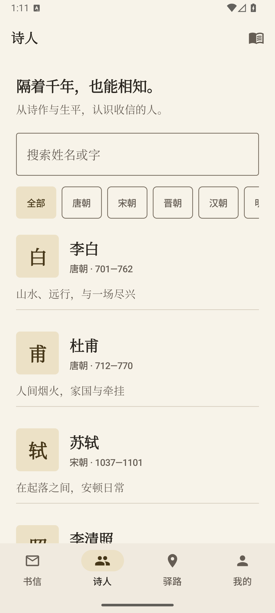
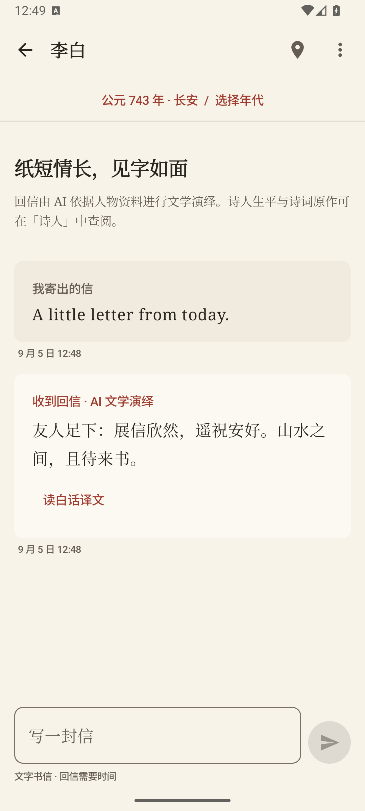
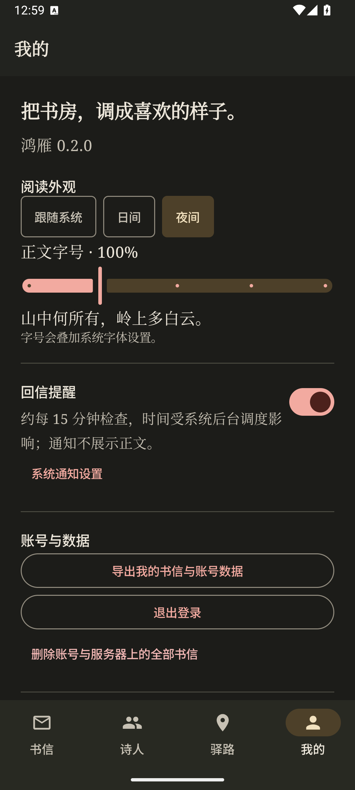

# 鸿雁 · AncientPoet

与 AI 扮演的古代诗人慢慢通信，在等待回信的间隙读诗、认识其生平，沿示意驿路选择落脚之处。

**当前版本：0.2.0，Android 文字书信体验版。** 本次完善打通了寄信、可靠生成与投递、阅读、草稿恢复、诗词原作、地图和账号数据管理。真实短信、真实模型、正式签名与小米真机验收仍属于上线前工作，不能把本地演示结果视作已经发布。

<p>
  
  
  
</p>

截图来自 Android 模拟器；账号、书信与模型回复均为本地合成测试数据。更多结果见 [验证记录](docs/VERIFICATION.md)。

## 现在可以做什么

| 入口 | 当前能力 |
| --- | --- |
| 书信 | 选择诗人与年代、选定位置、查看等待时间后寄信；查看原文与白话译文、未读提醒、历史分页、归档与删除 |
| 诗人 | 浏览 15 位诗人的生平与文学角色设定；按姓名、字和朝代筛选；从原本选择的诗人继续登录和写信 |
| 诗词阁 | 搜索、直接打开全文、阅读译文与赏析；10 篇核心诗词附原文来源，14 篇旧种子资料保留待核校标记 |
| 驿路 | 按朝代查看城市示意图；统一投影显示位置与路线；确认出发和到达状态，重启后仍能恢复 |
| 我的 | 日间／夜间／跟随系统、正文字号、可选回信提醒、JSON 数据导出、退出与账号删除 |

写信内容会用于 AI 生成和会话摘要。诗人的“通信气质”是文学角色设定，AI 回信是虚构创作；可查阅的诗词原作另行标注来源。

社区、图片上传、绘图入口暂不开放，相关服务端路由也未安装。Desktop 仅保留编译通过的占位模块，Web 尚未实现。具体完成度见 [当前状态](docs/STATUS.md) 和 [审查问题处理记录](docs/IMPLEMENTATION.md)。

## 本次重点修复

- 寄信返回真实消息 ID；客户端先保存草稿和幂等 ID，断网重试不会重复寄出同一封信，新编辑的草稿不会被旧回执清空。
- PostgreSQL 保存生成、翻译、投递和摘要任务，提供租约、重试与重复执行保护；进程重启后可继续，译文失败不阻止原文到达。
- 统一消息、时间、地图和诗词契约；补齐已读回执、收件箱同步、历史分页、迁徙恢复和级联删除。
- 区分访问令牌与刷新令牌，支持刷新轮换、重放撤销与账号隔离；补充短信失败反馈、发送预算、可信代理边界和脱敏错误。
- 调整键盘避让、小屏布局、夜间对比度、字号与操作说明；重建主导航、状态反馈、持久草稿和本地缓存。

## 开发环境

| 项目 | 要求 |
| --- | --- |
| JDK | 17 或更高；Windows 本次使用 Android Studio 内的 JBR 21，输出 JVM 17 字节码 |
| Android | compile/target SDK 35，最低 Android 8.0 / API 26 |
| 构建 | Gradle Wrapper 8.10、Kotlin 2.1.21、AGP 8.7.2 |
| 本地服务 | Docker / Compose v2，PostgreSQL 16 + PostGIS 3.4 |
| 验证脚本 | Python 3.10+；业务回归脚本只使用标准库 |

Windows 首次检出后，在不提交的 `local.properties` 中填写自己的 SDK 路径：

```properties
sdk.dir=C:/Users/your-name/AppData/Local/Android/Sdk
```

在 PowerShell 设置 JDK，例如：

```powershell
$env:JAVA_HOME='D:\AndroidStudio\jbr'
$env:Path="$env:JAVA_HOME\bin;$env:Path"
```

请先启动 Docker Desktop。脚本不会安装 Docker，也不会修改系统 Java 或代理设置。

## 启动本地演示

在仓库根目录运行：

```powershell
.\scripts\run_server.ps1 -InitializeDemo
```

首次运行会从 `deploy/.env.test.example` 生成忽略提交的 `deploy/.env`，随机生成数据库密码与 JWT 密钥，等待 PostgreSQL 就绪，构建并启动 API。已有环境文件不会被覆盖；已有数据库卷须使用其原有密码，修改环境变量不会重设卷内密码。

演示 API 默认监听 `127.0.0.1:8080`，使用本地固定回复，不调用收费短信或模型服务。登录页请求验证码后输入 `123456`，演示回信约 3 秒到达。此模式只供本机体验，不应暴露到公网。按 Ctrl+C 停止 JVM，数据库和数据卷会保留。

另一个终端构建客户端：

```powershell
.\gradlew.bat :androidApp:assembleDebug "-Dhttp.proxyHost=" "-Dhttps.proxyHost="
adb install -r androidApp/build/outputs/apk/debug/androidApp-debug.apk
```

默认调试地址 `http://10.0.2.2:8080/api/v1/` 用于 Android 官方模拟器。USB 连接真机时，可使用端口反向转发并显式构建：

```powershell
adb reverse tcp:8080 tcp:8080
.\gradlew.bat :androidApp:assembleDebug -PANCIENT_POET_API_BASE_URL=http://127.0.0.1:8080/api/v1/
adb install -r androidApp/build/outputs/apk/debug/androidApp-debug.apk
```

多设备连接时，对每个 adb 命令增加 `-s 设备序列号`。`run_server.ps1` 支持 `-EnvFile`、`-JavaHome` 和 `-ProjectName`；并行环境还须使用独立端口及 `POSTGRES_CONTAINER_NAME`。

## 可重复验证

```powershell
python scripts/validate_data.py
.\gradlew.bat :shared:jvmTest :server:test :androidApp:testDebugUnitTest :androidApp:lintDebug "-Dhttp.proxyHost=" "-Dhttps.proxyHost="
.\scripts\smoke.ps1
```

`smoke.ps1` 构建服务端后调用 `scripts/verify_business.py`，创建随机名称、随机密钥与独立端口的临时 PostgreSQL 容器，执行真实 HTTP、并发、进程恢复和 V3 旧库升级检查，结束后只清理自己创建的进程与容器。它不使用已有 `deploy/.env`，也不调用真实短信和模型。

Linux/macOS 可使用 `./gradlew :server:shadowJar` 后运行 `python3 scripts/verify_business.py`。使用 `--keep` 可保留本次隔离环境供客户端检查；地址写入忽略的 `build/verification/manual-environment.json`。Ctrl+C 或创建 `build/verification/stop-manual` 可结束该环境。

本次本地结果：**45 项单元测试、21 项数据库／HTTP 业务检查通过，Android Lint 无错误，Debug 与未签名 Release 编译通过**。326 个已解析 Maven 运行时版本经 OSV 扫描未命中已知漏洞；这只是扫描当时、该依赖范围内的结果。命令、证据范围与未验证项目见 [VERIFICATION.md](docs/VERIFICATION.md)。GitHub Actions 将在推送和 PR 上复跑质量流程。

## 配置真实服务与构建发布候选

从 `deploy/.env.example` 建立自己的私有环境，至少配置：

- PostgreSQL 凭据和独立随机 `JWT_SECRET`。
- `KTOR_DEVELOPMENT=false`、`AI_MODE=remote`；移除 `DEV_DELIVERY_SECONDS`。
- HTTPS 模型端点、当前账号可用的模型名称和 API Key。模板模型名称只是配置默认值，需以供应商账号实际权限为准。
- 腾讯云短信的 SecretId/SecretKey、SDK App ID、已审核签名及模板 ID；模板应与“单个验证码参数”的发送适配一致。
- Nginx 的真实域名、证书与代理地址；`TRUSTED_PROXY_HOSTS` 只填写实际代理的连接地址。

`deploy/nginx/nginx.conf` 是待替换域名与证书路径的部署模板，服务端由宿主机运行并监听回环地址。当前文字书信链路只依赖 PostgreSQL；Redis、MinIO 在 `legacy-media` profile 下，未纳入本次生产验证。升级前备份数据库：已验证 V1–V6 全新迁移及 V3→V6 升级；不提供破坏性回退脚本。

Release 构建必须显式提供 HTTPS API 地址，缺失或明文地址会失败：

```powershell
.\gradlew.bat :androidApp:assembleRelease -PANCIENT_POET_API_BASE_URL=https://your-domain.example/api/v1/
```

输出为 `androidApp/build/outputs/apk/release/androidApp-release-unsigned.apk`。需要自己的正式签名、真实服务验收与分发流程后才能发布；仓库不包含签名密钥，未将调试包充当正式版本。

## 数据与体验边界

信件投递由服务端统一计算，通常限制在 2 小时至 7 天；迁徙按约 50 km/日计算，限制在 1 小时至 7 天，首次选址立即完成。地图用于通信位置示意，不提供历史行政边界或真实导航保证。

会话凭据使用 Android Keystore + AES-GCM 保存，关闭系统备份和设备迁移；书信缓存与草稿存储在应用私有 SQLite，**数据库本身没有额外加密**。账号隔离、清理逻辑与加密存储不是同一件事。服务器保存书信和摘要，配置远程模型后会发送生成所需上下文，详情在登录与设置页说明。

回信提醒需要用户开启并授予通知权限，使用 WorkManager 约每 15 分钟检查，不在通知展示正文。[Android 官方文档](https://developer.android.com/develop/background-work/background-tasks/persistent/getting-started/define-work)说明周期任务可被系统延后；小米 HyperOS 的锁屏、重启与省电情形仍需真机验收。

## 目录与文档

```text
androidApp/   Android Compose 客户端、会话、通知与设置
shared/       KMP API 契约、客户端、SQLDelight 缓存、地图投影
server/       Ktor API、PostgreSQL 事务与任务、Flyway 迁移
desktopApp/   保留的桌面占位模块
data/         诗人与城市资料、核心诗词核校清单
deploy/       环境模板、Compose、Nginx 模板
scripts/      启动、数据验证、业务回归与依赖审计
docs/         当前状态、实施记录、验证记录、实际界面截图
DESIGN/       历史设计规范与原型资料
```

[架构说明](ARCHITECTURE.md) · [当前状态](docs/STATUS.md) · [问题处理记录](docs/IMPLEMENTATION.md) · [验证记录](docs/VERIFICATION.md)

历史计划与报告反映当时情况；以当前状态和验证记录为准。项目沿用原 README 的 MIT 许可声明，第三方组件与资料分别遵循其来源许可。
