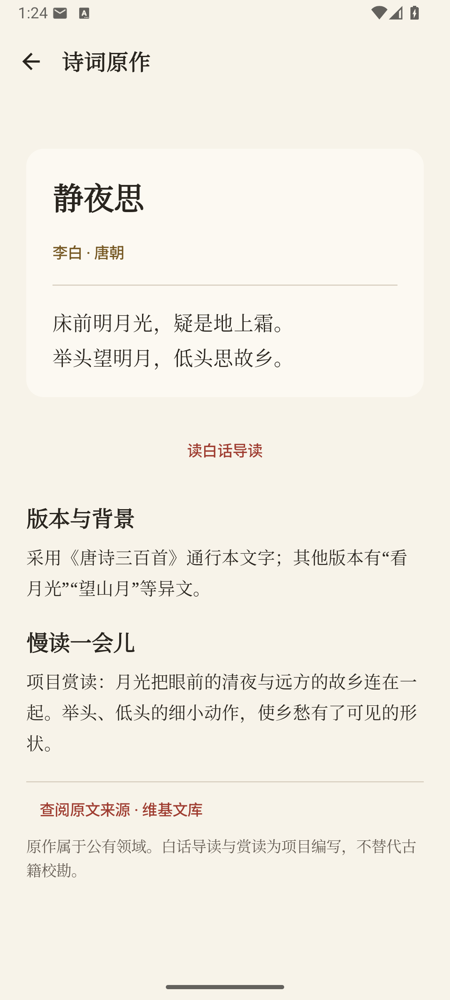
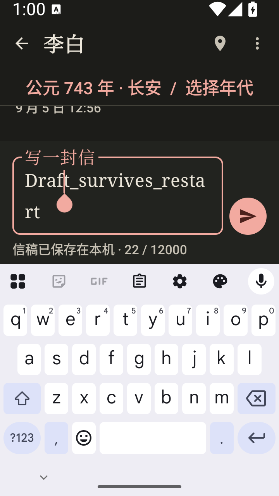
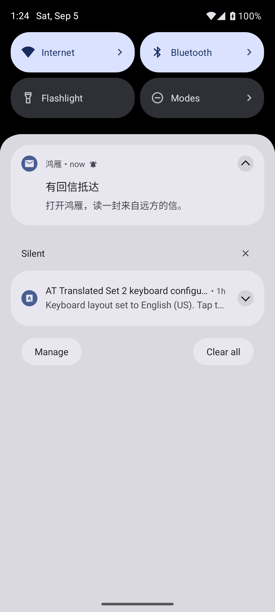

# 0.2.0 验证记录

验证日期：2026-09-05。环境：Windows、JBR 21（JVM 17 目标）、Android SDK 35、Android 36 Pixel 7 模拟器、Docker 中隔离的 PostgreSQL 16/PostGIS 3.4。CI 使用 Ubuntu/JDK 17，实际运行结论以对应提交的 Actions 为准。

所有账号、消息和模型回复均为合成测试数据。本次没有发送真实短信、调用收费模型、部署公网服务或发布签名安装包。

## 已完成的检查

| 检查 | 结果 | 范围 |
| --- | --- | --- |
| shared JVM 单元测试 | 13 通过 | 草稿重启/条件 ACK、账号分区、地图投影与原有基础逻辑 |
| server 单元测试 | 15 通过 | JWT 类型、健康、可信代理边界等 |
| Android 单元测试 | 17 通过 | 登录失败状态、网络鉴权、刷新竞态、重试与会话恢复 |
| Android Lint | 0 错误，28 警告，1 信息 | 多数警告为依赖升级提示；无“零警告”声明 |
| PostgreSQL + HTTP 回归 | 21 项通过 | 真实 JDBC、迁移、事务、HTTP、并发与重启；模型仅用本地 HTTP 替身 |
| 数据验证 | 通过 | 15 份诗人 JSON、5 份城市 JSON、10 篇核心诗词清单与 V5 SQL 一致 |
| 构建 | 通过 | Android Debug、未签名 Release、Server 胖 JAR、Desktop 占位模块 |
| 发布端点检查 | 通过 | 无显式端点时构建失败；HTTPS 测试端点可编译；产物禁止备份与明文通信 |
| Maven 运行时依赖 | 326 个版本，无 OSV 命中 | 扫描时点结果；不含容器镜像、漏洞可利用性或完整系统审计 |
| Windows 本地启动脚本 | 通过 | 独立 Compose 项目和数据卷启动、迁移、就绪、演示登录；结束后清理自建环境 |

Release 验证使用 `https://verification.invalid/api/v1/`，属于不可访问的编译测试端点；产物未签名，不代表已部署可用的发布包。调试 UI 使用本机反向转发连接隔离 API。

## 21 项业务回归

1. 全新 Flyway 迁移和 PostgreSQL 就绪探针。
2. V3→V6 升级保留信件、摘要，修复送达状态与通信默认年份。
3. 社区和上传路由不开放。
4. 访问/刷新令牌隔离，非法号码拒绝。
5. 15 位诗人仍可读取。
6. 所有人物详情可序列化，默认年处于生卒年范围。
7. 核心诗词全文、直接详情及搜索可读取。
8. 会话读取、写入和故事线均拒绝其他账号。
9. 不同朝代城市不同，服务端验证坐标。
10. 寄信 ACK 有真实 ID；用户信可见；重复请求幂等；未到达正文隐藏。
11. 翻译服务失败时原文仍可到达。
12. 翻译独立重试恢复；生成上下文中本次输入仅出现一次。
13. 收件箱名称、未读数量和已读回执一致。
14. 终止并重启服务后，过期租约可恢复且仅持久化一封回复。
15. 四个并发重复请求只创建一封用户信与一个任务。
16. 超过 50 条历史时最新页和旧游标保持正确顺序。
17. 迁徙出发/到达持久化，重叠出发被拒绝。
18. 归档/恢复、归档后的幂等收据、私有导出和级联删除。
19. 刷新轮换后旧令牌重放撤销受影响会话。
20. 退出和删除账号使现有访问会话失效。
21. 生产无演示验证码旁路；短信缺配置失败，发送预算跨请求保存。

脚本生成 `build/verification/business-results.json`。测试结束后清理随机名称的专属 PostgreSQL 容器和 JVM，不停止已有项目服务。

## Android 实际操作

在 Android 36 模拟器中实操并检查截图/XML：

- 游客浏览诗人；从李白资料页进入登录后，继续原诗人的年代与写信流程。
- 城市从地图/列表进入可见确认面板，选址与服务端状态一致。
- 键盘弹出后正文和发送按钮可操作；确认寄信后用户信和本地模型回信实际出现。
- 阅读原文与译文；从诗人进入诗词阁，打开《静夜思》全文和来源说明。
- 强制停止应用后重新启动，登录状态和未发送草稿恢复；凭据文件只有加密封装键，未发现明文 JWT。
- 断开本机 API 转发后再次冷启动，缓存收件箱与原登录身份仍可见；请求超时后显示“网络连接失败”及重试入口。
- 系统文件选择器中保存个人数据 JSON，并从下载目录读回解析，验证账号、会话和已到达消息。
- 授予 Android 通知权限后重新开启提醒，WorkManager 首次检查发现未读回信，通知栏实际显示“有回信抵达”；正文没有进入通知。
- 在线退出后，私有收件箱从导航中清除，已显示的回信通知被取消。
- 日间/夜间切换；夜间状态栏图标可读。
- 360×640 dp 叠加 150% 系统字号，键盘上方编辑与发送仍可见。此极端组合下历史区域变小，需要关闭键盘阅读，未将其描述为无空间代价。

周期任务按 Android 调度规则运行，不能用一次首次检查证明后台长期准时到达。后台限制参见 [Android WorkManager 文档](https://developer.android.com/develop/background-work/background-tasks/persistent/getting-started/define-work)。

## 界面证据

<p>
  
  
  
</p>
<p>
  
  
  
</p>

## 复跑命令

Windows：

```powershell
$env:JAVA_HOME='D:\AndroidStudio\jbr'
python scripts/validate_data.py
.\gradlew.bat :shared:jvmTest :server:test :androidApp:testDebugUnitTest :androidApp:lintDebug "-Dhttp.proxyHost=" "-Dhttps.proxyHost="
.\gradlew.bat :androidApp:assembleDebug :desktopApp:compileKotlinJvm :server:shadowJar "-Dhttp.proxyHost=" "-Dhttps.proxyHost="
python scripts/verify_business.py --java "$env:JAVA_HOME\bin\java.exe"
.\gradlew.bat :androidApp:assembleRelease -PANCIENT_POET_API_BASE_URL=https://verification.invalid/api/v1/ "-Dhttp.proxyHost=" "-Dhttps.proxyHost="
```

依赖审计（运行时的直接与传递依赖）：

```powershell
New-Item -ItemType Directory -Force build/verification | Out-Null
.\gradlew.bat :server:dependencies --configuration runtimeClasspath --console=plain > build/verification/server-dependencies.txt
.\gradlew.bat :androidApp:dependencies --configuration debugRuntimeClasspath --console=plain > build/verification/android-dependencies.txt
python scripts/audit_dependencies.py build/verification/server-dependencies.txt build/verification/android-dependencies.txt --fail-on-match
```

审计只向 [OSV API](https://google.github.io/osv.dev/api/) 发送公开 Maven 坐标和版本。网络不可用应报告失败，不把无法查询当作零命中。新漏洞披露后，同一锁定版本也可能在未来扫描中失败。

Linux 使用 `./gradlew`、`python3` 和对应 `JAVA_HOME/bin/java`。质量 workflow 包含数据、单元、Lint、编译、隔离业务回归、发布配置和依赖审计。

## 尚未由本次结果证明的能力

真实短信送达率、真实模型生成质量/费用/限额，正式签名安装与覆盖升级，小米 HyperOS 的锁屏/重启/省电通知，Android 最低版本与完整 TalkBack，生产 Nginx、数据库备份恢复、多实例负载、长期稳定性，社区与媒体，以及完整 Desktop/Web。

本地原始日志、模拟器数据、测试凭据和运行端点留在忽略目录，不随仓库上传；只提交合成界面截图、脚本和上述可复跑记录。
